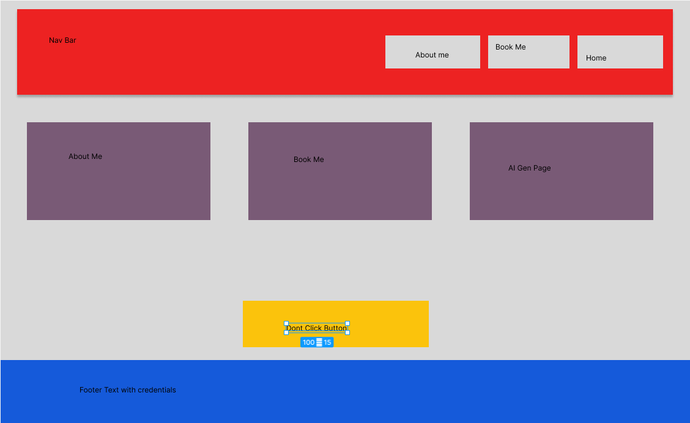

# Design Document - Personal Portfolio Webpage

## Project Description

The Personal Portfolio Webpage is a professional introduction site designed to showcase my skills, projects, and personality. It serves as a digital representation of your professional identity and creative capabilities. The site features a clean, modern design with an emphasis on user experience and accessibility.

---

## User Personas

### Persona 1: Looking for a coach

Someone that is looking for a volleyball coach can come to my website and press on the "Book Me" button to be linked to
an external scheduling system (not yet implemented).

### Persona 2: Recuitor

Any tech recruitor can come on to my website to see what I'm into, such as music genre of my choice.

### Persona 3: The Casual Visitor

Any random person in the world that is wondering how my journey began can come to the about me page and learn more.

---

## User Stories (Use Cases)

### Story 1: Find a Volleyball Coach

As a person looking for a volleyball coach  
I want to easily find and use the "Book Me" feature  
So that I can schedule a session with Ricky

### Story 2: Recruiter Browsing Interests

As a tech recruiter  
I want to quickly see Ricky's skills, interests, and background  
So that I can assess if he's a good fit for my company

### Story 3: Connect with Ricky

As a visitor interested in collaborating or learning more  
I want to access Ricky's contact or social media information  
So that I can reach out for coaching, collaboration, or questions

---

## Color Scheme

- **Primary Color:** #2c3e50 (Dark Slate Blue) - Used for navigation and main text
- **Secondary Color:** #3498db (Bright Blue) - Used for accents and buttons
- **Accent Color:** #e74c3c (Coral Red) - Used for CTAs and highlights
- **Light Background:** #ecf0f1 (Light Gray) - Used for section backgrounds
- **Text Color:** #2c3e50 - Main text color for readability

---

## Typography

- **Font Family:** Segoe UI, Tahoma, Geneva, Verdana, sans-serif
- **Heading Sizes:** H1 (3rem), H2 (2rem), H3 (1.5rem)
- **Body Font Size:** 1rem
- **Line Height:** 1.6

---

## Key Features

1. **Responsive Design:** Mobile-first approach with breakpoints at 768px and 480px
2. **Navigation:** Sticky navbar with active state indicators
3. **Grid Layouts:** CSS Grid and Flexbox for flexible, modern layouts
4. **Interactive Elements:** Hover effects and smooth transitions
5. **Semantic HTML:** Proper use of semantic tags for accessibility
6. **ES6 Modules:** Modular JavaScript architecture
7. **Creative Component:** Display random inspirational quotes related to coding
8. **AI-Generated Page:** Unique content showcasing AI collaboration

---

## Accessibility Considerations

- All images include alt text
- Semantic HTML elements (nav, main, section, article, footer)
- Sufficient color contrast ratios
- Keyboard navigation support
- Focus indicators on interactive elements
- Responsive text sizing

---

## Technical Stack

- **Markup:** HTML5
- **Styling:** CSS3 (Grid, Flexbox, CSS Variables)
- **JavaScript:** ES6 Modules
- **Tools:** Prettier (code formatting), ESLint (linting)
- **Deployment:** GitHub Pages

## Wireframes

